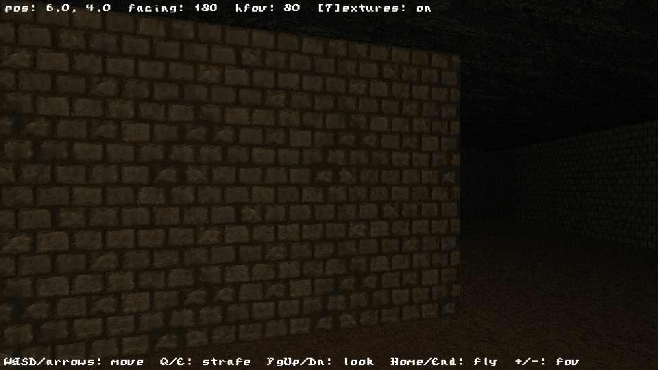
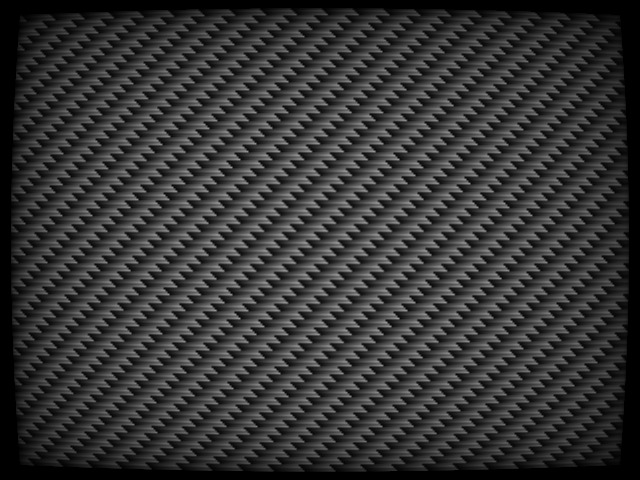
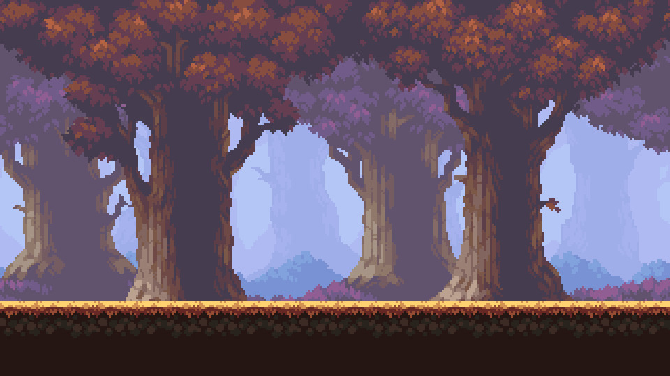
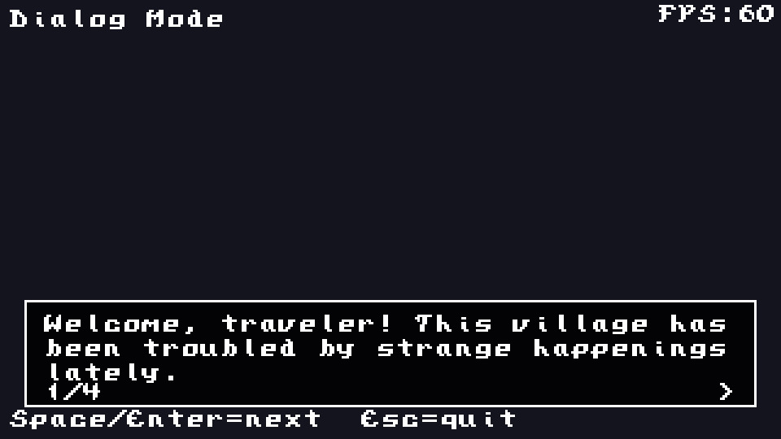
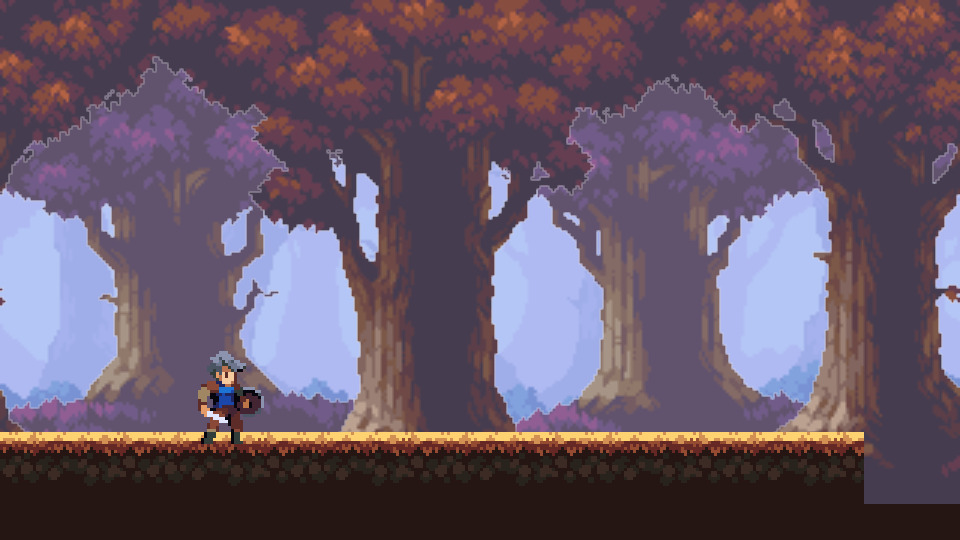
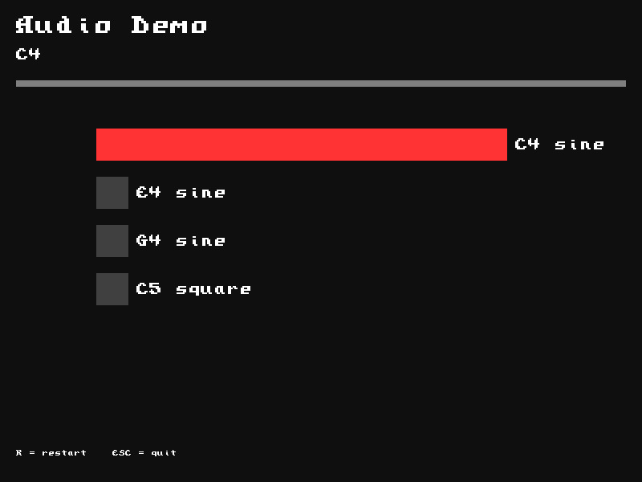
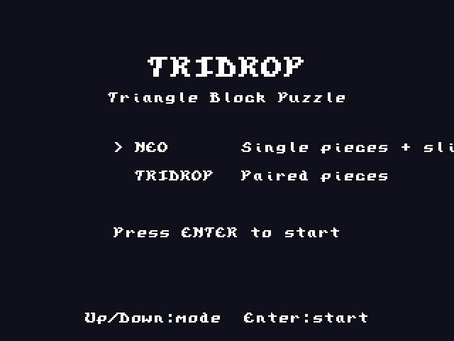
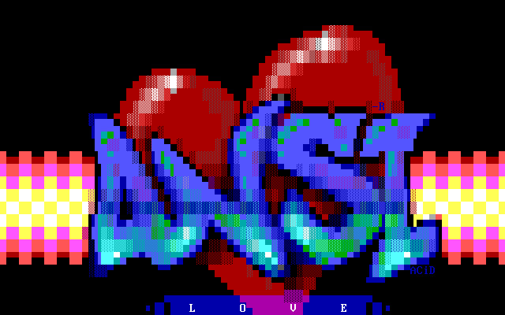
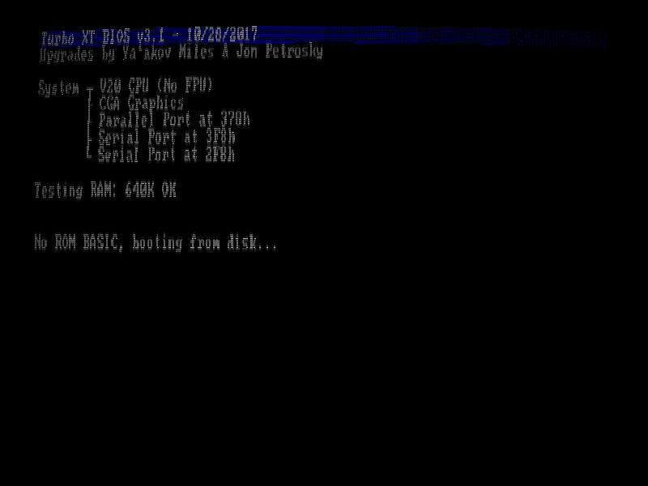

# Ludica [](https://github.com/OrangeTide/gamedev/actions)

A lightweight cross-platform graphics library for games and demos,
built on OpenGL ES 2.0 and 3.0.

Ludica provides a minimal C API for windowing, input, shaders, meshes,
textures, sprites, fonts, and framebuffer effects. Programs choose GLES2
(for low-end targets like Pi Zero) or GLES3 (for normal-mapped PBR and
WebGL 2) at startup. Several demo programs and a portal-based 3D engine
(`hero`) are included.

## Samples

### hero — Portal-based 3D engine


### demo01_retrocrt — Palette framebuffer with CRT post-processing


### demo02_multiscroll — Parallax scrolling and sprite batching


### demo03_text_dialogs — Font rendering and dialog box UI


### demo04_sprites — Sprite rendering


### demo05_audio — Multi-channel audio mixer


### tridrop — Triangle block puzzle


### ansiview — ANSI art viewer


### lilpc — 286 XT PC emulator with CGA display


## Building

Requires GCC (or MinGW-w64 on Windows) and GNU Make.

```sh
make                # default build
make RELEASE=1      # optimized (-O2, LTO)
make DEBUG=1        # debug symbols
```

Output goes to `_out/<triplet>/bin/` (e.g. `_out/x86_64-linux-gnu/bin/hero`).

Cross compile for Windows:

```sh
make CONFIG=configs/mingw32_config.mk
```

### WebAssembly (Emscripten)

Build any sample for the browser:

```sh
make <target> CC=emcc CXX=em++ AR=emar          # debug
make <target> CC=emcc CXX=em++ AR=emar RELEASE=1 # optimized
```

Output goes to `_out/wasm32-unknown-emscripten/bin/<target>.html`
(with `.js`, `.wasm`, and `.data` sidecar files).

Serve the output directory over HTTP and open the `.html` file:

```sh
cd _out/wasm32-unknown-emscripten/bin
python3 -m http.server 8000
# open http://localhost:8000/tridrop.html
```

Samples that load assets (textures, fonts) use `--preload-file` in their
`module.mk` to bundle assets into the `.data` file automatically.

### Linux dependencies

Ubuntu / Debian:

```sh
sudo apt-get install -y build-essential git \
    libx11-dev libxext-dev libxfixes-dev libxi-dev \
    libxcursor-dev libegl1-mesa-dev libgles2-mesa-dev
```

### Windows dependencies

Install [MSYS2](https://www.msys2.org/) with MINGW64, or
[w64devkit](https://github.com/skeeto/w64devkit). Then fetch headers
and ANGLE libraries:

```sh
cd src/ludica
./download-headers.sh
cd win32libs
./update-binaries.sh
```

## Running

```sh
_out/x86_64-linux-gnu/bin/hero
```

## Directory layout

- `src/ludica/` -- Core library (platform, shaders, meshes, textures, sprites, fonts)
- `samples/hero/` -- Portal-based 3D engine
- `samples/demo01_retrocrt/` -- CRT post-processing demo
- `samples/demo02_multiscroll/` -- Parallax scrolling demo
- `samples/demo03_text_dialogs/` -- Font and dialog demo
- `samples/demo04_sprites/` -- Sprite rendering demo
- `samples/demo05_audio/` -- Multi-channel audio mixer demo
- `samples/tridrop/` -- Triangle block puzzle
- `samples/ansiview/` -- ANSI art viewer
- `samples/lilpc/` -- 286 XT PC emulator
- `src/thirdparty/` -- Header-only dependencies (stb_image, stb_ds, miniaudio)
- `assets/textures/` -- PBR textures (CC0, see [CREDIT.md](CREDIT.md))
- `tools/` -- Build-time code generators

## License

This project is licensed under the [0BSD License](LICENSE).

## Acknowledgments

- [ambientCG](https://ambientcg.com/) -- CC0 PBR textures
- [Dear ImGui](https://github.com/ocornut/imgui) / [cimgui](https://github.com/cimgui/cimgui)
- [stb](https://github.com/nothings/stb) -- stb_image, stb_ds
- [HandmadeMath](https://github.com/HandmadeMath/HandmadeMath) -- single-header math library
- [miniaudio](https://miniaud.io/) -- single-header audio library
- [Using OpenGL ES on Windows via EGL](https://www.saschawillems.de/blog/2015/04/19/using-opengl-es-on-windows-desktops-via-egl/)
